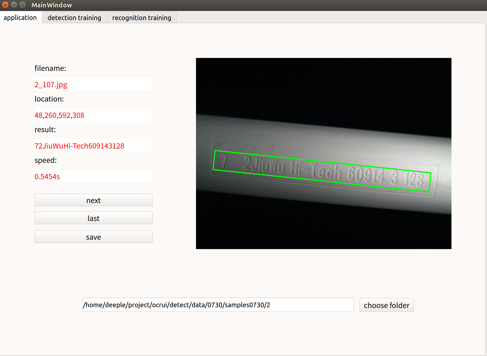
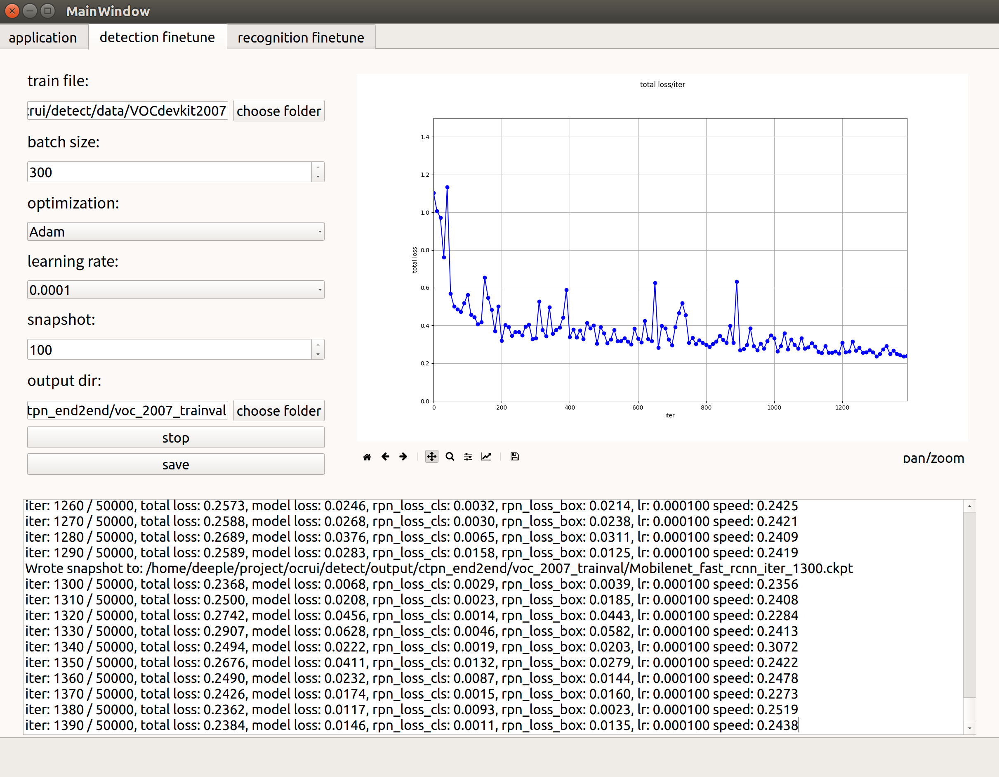
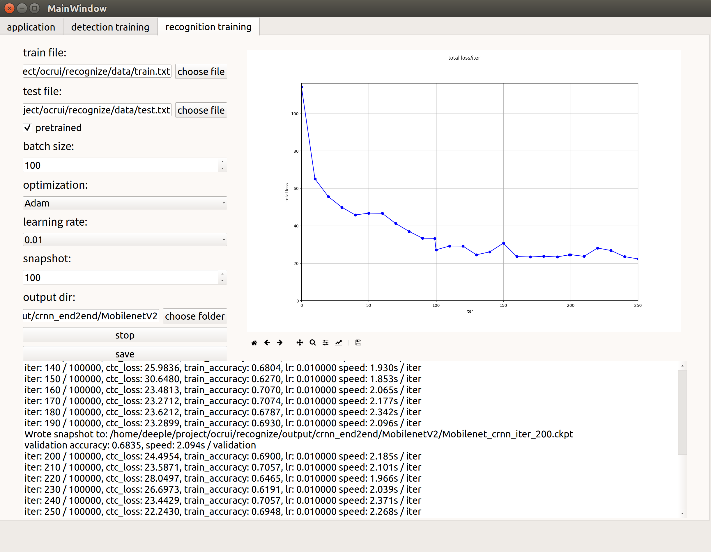

Optical Character Recognition UI Software 
=========================================

This software implements the optical character recognition of carved text on the plaster sticks based on [CTPN](https://github.com/eragonruan/text-detection-ctpn) and [CRNN](https://github.com/bgshih/crnn) implemented in Tensorflow, where the network architectures are inspired by MobileNet V1 and MobileNet V2.

Requirements
------------
python3.5  
tensorflow_gpu==1.8.0  
PyQt==5.9.1  
opencv_python==3.4.1  
easydict==1.7  
numpy==1.14.0  
Cython==0.27.3  
Pillow==5.0.0  
PyYAML==3.12   

Run software
------------

A main program can be found in ``main.py``. Before running the program, download a pretrained model from [here](https://download.csdn.net/download/herosofearth/10605637). Put the downloaded model directory ``stickmobilev1`` into directory ``detect/checkpoints/``, and put the ``mobilev2`` into ``recognize/checkpoints/``.Then launch the program by:

    python main.py

Example images
--------------

One shot recognition:

Training detection task:

Training recognition task:

References
----------
[Tian Z, Huang W, He T, et al. Detecting Text in Natural Image with Connectionist Text Proposal Network[J]. 2016:56-72.](https://arxiv.org/abs/1609.03605)

[Shi B, Bai X, Yao C. An End-to-End Trainable Neural Network for Image-Based Sequence Recognition and Its Application to Scene Text Recognition[J]. IEEE Transactions on Pattern Analysis & Machine Intelligence, 2015, 39(11):2298-2304.](http://arxiv.org/abs/1507.05717)

[Howard A G, Zhu M, Chen B, et al. MobileNets: Efficient Convolutional Neural Networks for Mobile Vision Applications[7]. 2017.](https://arxiv.org/abs/1704.04861)

[Sandler M, Howard A, Zhu M, et al. MobileNetV2: Inverted Residuals and Linear Bottlenecks[J]. 2018.](https://arxiv.org/abs/1801.04381)

